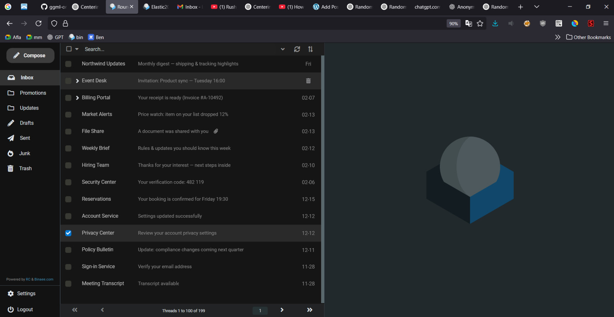
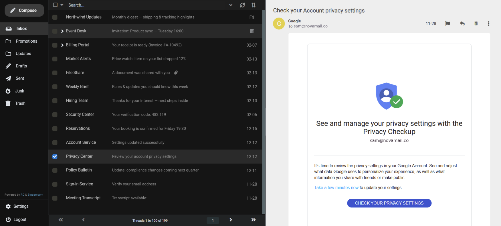

# Elastic2025
Elastic2025 is a dark RoundCube theme based on the [Elastic2022](https://github.com/seb1k/Elastic2022) by [Seb1k](https://www.roundcubeforum.net/index.php?action=profile;u=66688).
Gmail [removed the ability to pull messages from other domains as of Jan 2026](https://support.google.com/mail/answer/16604719?hl=en). This project aims to offer a simple drop-in replacement webmail experience in RoundCube (especially on desktop).  Please consider [**DONATING**](https://www.paypal.com/donate/?hosted_button_id=N9LJWC4WH8ZJC) if you liked it.

## Screenshot

## 🛠️ Installation

1. Download the [Elastic2025 Theme](https://github.com/bijanbina/Elastic2025/archive/refs/heads/main.zip)
2. Copy all of its content into your RoundCube installation inside the skin folder. The result should be something like
    `<RoundCube>/skin/elsastic2025/*`
3. Enable the theme by going into the RoundCube `Settings > User Interface > Interface skin`
4. Follow the [Tweaks page](TWEAKS.md) to get the exact result shown in the screenshots.

## 🐞 Known Issues

- Does not work on Android (for now)
- Icon issues on the Settings page and Compose/Send page

## ⭐ Wishlist

Many features are missing, these require more time & effort and I work on them if the project get enough traction.

- Spell checking
- AI autocomplete
- Same page reply and draft
- Better thread handling in a same page
- Full-Width mail list -> transient to half only when clicked on a mail
- Simplify installation
- Simplify deployment

## 🤝 Support and Contribution

If you find a bug you can easily fix it using the browser inspector and editing the corresponding CSS file. If you like your fix to be merge into the mainstream please don’t hesitate to create [a pull request on the GitHub page](https://github.com/bijanbina/Elastic2025/pulls) and if it matches our style, it will be merged.

If you notice a bug but you don’t have time to fix it or create the pull request please consider donating. We know the theme currently has many bugs and by donating even a small number you keep helping to fix all these bugs. The theme took almost 2000 hours to refine and publish, so if those hours help you, a small donation would be appreciated.

[Topic on the roundcube's forum](https://www.roundcubeforum.net/index.php/topic,29883.0.html)
[Blog Post](https://blog.binaee.com/2026/02/elastic2025-roundcube-dark-theme/)
