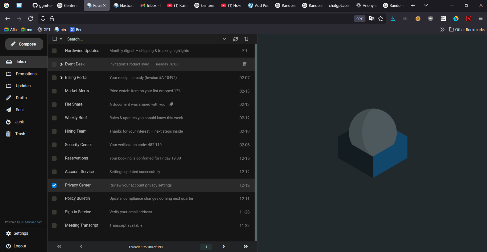
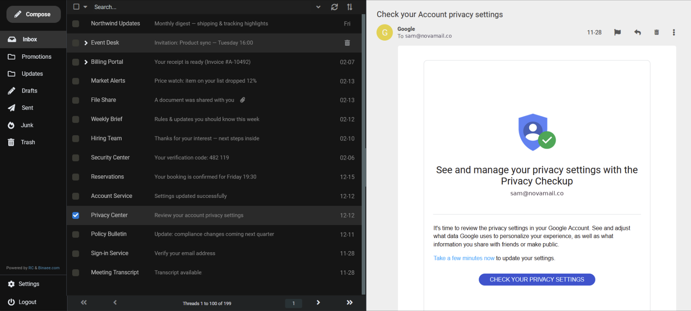

# Elastic2025
A dark theme based on [Elastic2022](https://github.com/seb1k/Elastic2022).
Gmail stopped [message pulling from domains](https://support.google.com/mail/answer/16604719?hl=en) which motivated me to create a replacement in RoundCube.  

## Please [**DONATE**](https://www.paypal.com/donate/?hosted_button_id=N9LJWC4WH8ZJC) any amount help so don't skip!

## Screenshot

## 🛠️ Installation

1. Download the [Elastic2025 Theme](https://github.com/bijanbina/Elastic2025/archive/refs/heads/main.zip)
2. Copy all of its content into your RoundCube installation inside the skin folder. The result should be something like
    `<RoundCube>/skin/elsastic2025/*`
3. Enable the theme by going into the RoundCube `Settings > User Interface > Interface skin`
4. Follow the [Tweaks page](TWEAKS.md) to get the exact result shown in the screenshots.

## 🐞 Known Issues

- Does not work on Android (for now)
- Icon issues on the Settings page and Compose/Send page

## ⭐ Wishlist

Many features are missing, these require more time & effort and I work on them if the project get enough traction.

- Spell checking
- AI autocomplete
- Same page reply and draft
- Better thread handling in a same page
- Full-Width mail list -> transient to half only when clicked on a mail
- Simplify installation
- Simplify deployment

## 🤝 Support and Contribution

Found a bug? Fix it by editing the CSS file. If you like to merge it with mainstream, create a [pull request](https://github.com/bijanbina/Elastic2025/pulls).

Notice a bug but you don’t have time? Donate with following button. That let us have time to fix these bugs. Thanks!

[Topic on the roundcube's forum](https://www.roundcubeforum.net/index.php/topic,29883.0.html)
[Blog Post](https://blog.binaee.com/2026/02/elastic2025-roundcube-dark-theme/)
